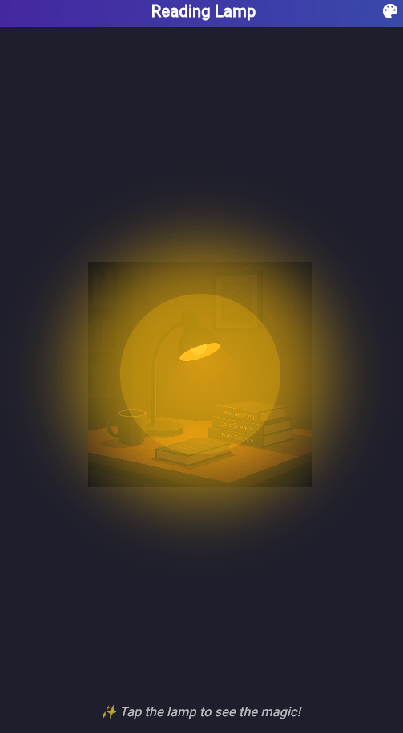

# 🔆 Lampy - A Magical Reading Lamp App

Lampy is a charming and interactive Flutter app that simulates a cozy study lamp in a reading room. With a simple tap, the lamp lights up — and you can even change its glow color! It's a relaxing, minimal app designed to show off clean UI and smooth animation in Flutter.

---

## ✨ Features

- 💡 Tap to toggle the lamp on or off  
- 🎨 Select light color from a smooth color picker  
- 🌟 Glowing animation effect when the lamp is on  
- 🛋️ Cozy and aesthetic room design  
- 📱 Lightweight and easy to use  

---
## 📸 Preview

